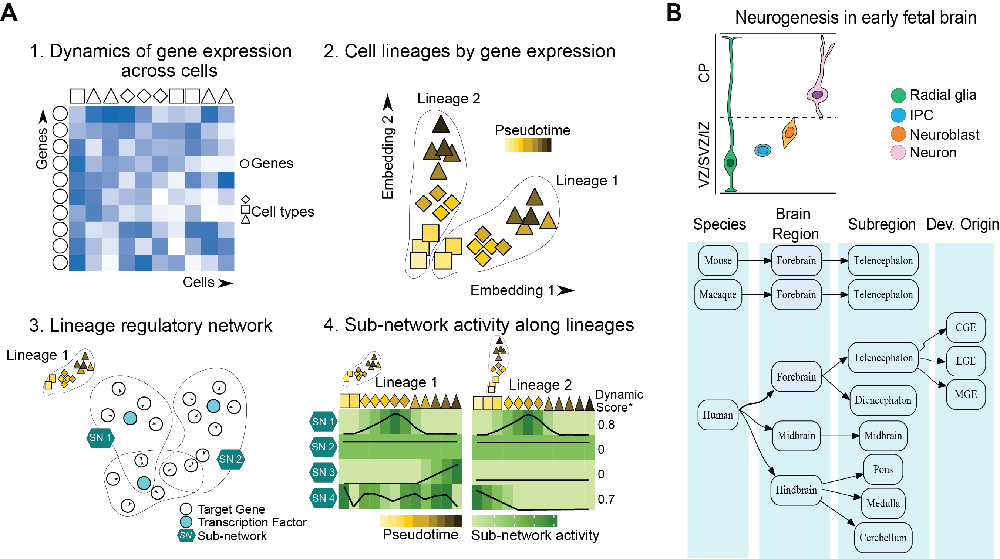

# devGRNDB

## Step 1 - data preprocessing

* 1.1 -  `preprocess.py` 
  Initial preprocessing steps, cell type annotations, pseudobulk calculations.
  
## Step 2 - lineage inference

* 2.1 - `getLineage.py` 
  Trajectory and lineage inference
  
## Step 3a - GRN inference

* 3a.1 -  `preprocess.py` 
  saving the h5ad file into a loom file for pySCENIC run

* 3a.2 - `runPySCENIC_batch_human_macaque` 
	bash file for running pySCENIC on CLI.
	it outputs "_adj" file and a "_ctx" files containing GRNs.
* 3a.3 - `cleanCTX.py`
	this function cleans up the ctx file to get a GRN dataframe

## Step 3b - Subnetwork analysis
* 3b.1 - `getRegulons.R`
	Inputs a GRN and a minimum number of target a TF should have to be a regulon (Default 5)
  
* 3b.2 - `getCoRegNet.R`
	Inputs a GRN and returns a coregulatory network that can be used obtain coregulatory gene modules
  
	* 3b.2.1 - `getCoRegModules.R`

## Step 4 - subnetwork activity

* 4.1 `calcSubNetActivity.R`
	this will calculate the AUCell enrichment scores (i.e., subnetwork activity scores) for inferred subnetworks in step 3b
  
* 4.2 `calcMoran.R`
	this will calculate dynamic scores using inferred pseudotimes and activity scores. It contains 2 executable functions getMoran() and readAndProcessMoran(). getMoran will perform the Moran's I calculations and write the relevant results to an user-specified folder. readAndProcessMoran() function will read the corresponding results file and perform necessary filtering for downstream analysis.

## License

This project is licensed under the Apache License, Version 2.0.
See the [LICENSE](LICENSE) file for details.
