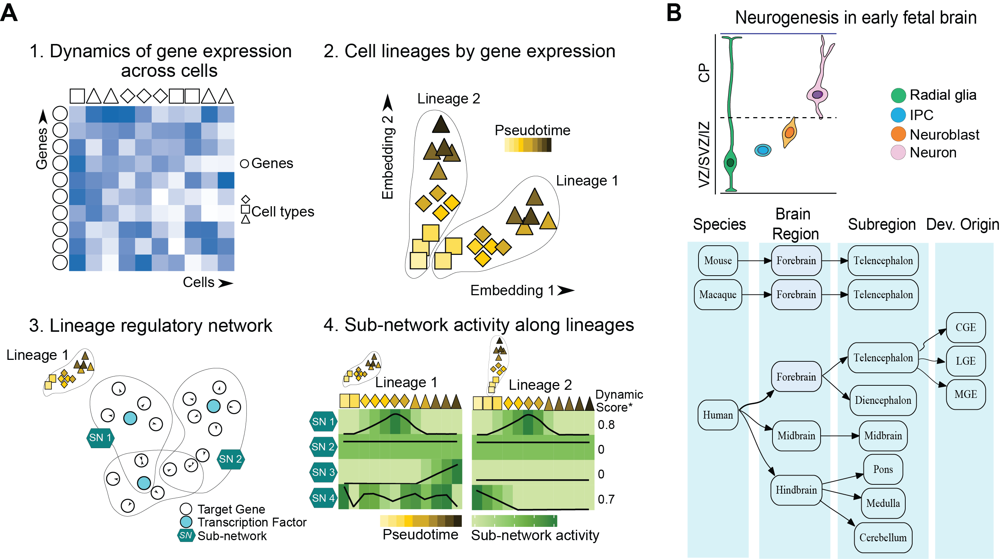

# devGRNDB

This resource contains the codes used in the manuscript titled "Dynamic landscapes of gene regulatory networks during early mammalian neurogenesis for understanding brain evolution and disorder risk". 

Please refer to the manuscript for more details. 

The proposed computational framework consists of 4 steps. 

## Step 1 - data preprocessing

* Initial preprocessing steps, cell type annotations, and obtaining pseudocells
* Standard SCANPY/Seurat preprocessing steps can be used.
* Obtaining pseudocells is not mandatory. Pseudocells will improve the accuracy of the GRN inference. We recommend using a fixed downsampling ratio across ages and cell types to preserve the biological heterogeneity among cell types across development. 
  
## Step 2 - lineage inference

* Lineage inference can be done using any state of the art lineage/trajectory inference method.
* We recommend using methods that provide lineage assignments (for different terminal cell fates) as our framework cannot be used for branching trajectories. Example code is provided in `Neurogenesis.ipynb`.
  
## Step 3a - GRN inference
* Any GRN inference method could be utilized.
* Our study used  GRN inference method.
* Attached are the codes utiized in our study. 
	* 3a.1 -  `preprocess.py` 
	  saving the h5ad file into a loom file for pySCENIC run
	
	* 3a.2 - `runPySCENIC_batch_human_macaque` 
		bash file for running pySCENIC on CLI.
		it outputs "_adj" file and a "_ctx" files containing GRNs.
	* 3a.3 - `cleanCTX.py`
		this function cleans up the ctx file to get a GRN dataframe

## Step 3b - Subnetwork analysis
* 3b.1 - `getRegulons.R`
	Inputs a GRN and a minimum number of target a TF should have to be a regulon (Default 5)
  
* 3b.2 - `getCoRegNet.R`
	Inputs a GRN and returns a coregulatory network that can be used obtain coregulatory gene modules
  
	* 3b.2.1 - `getCoRegModules.R`

## Step 4 - subnetwork activity

* 4.1 `calcSubNetActivity.R`
	this will calculate the AUCell enrichment scores (i.e., subnetwork activity scores) for inferred subnetworks in step 3b
  
* 4.2 `calcMoran.R`
	this will calculate dynamic scores using inferred pseudotimes and activity scores. It contains 2 executable functions getMoran() and readAndProcessMoran(). getMoran will perform the Moran's I calculations and write the relevant results to an user-specified folder. readAndProcessMoran() function will read the corresponding results file and perform necessary filtering for downstream analysis.

## Datasets
Current study used three existing datasets. 

* Braun et al. (Human) – accession number: EGAS00001004107
* La Manno et al (Mouse) – accession number: PRJNA637987
* Micali et al (Macaque) – accession number : GSE226451 

Our findings can be interactively visualized in https://daifengwanglab.shinyapps.io/devGRNDB/   

## License

This project is licensed under the Apache License, Version 2.0.
See the [LICENSE](LICENSE) file for details.
